# Project ARK — System Architecture (Mermaid)

Copy the entire code block below and paste it into [mermaid.live](https://mermaid.live) to render the diagram.

```mermaid
flowchart TB
    %% ══════════════════════════════════════════
    %% EXTERNAL DATA SOURCES
    %% ══════════════════════════════════════════
    subgraph EXT["☁️ External Data Sources"]
        direction LR
        EONET_API["🛰️ NASA EONET v3\nLive Floods & Severe Storms\nPH Bounding Box Filter"]
        STAC["🌍 ESA Copernicus\nSentinel-2 L2A\nSTAC Scene Retrieval"]
        SAR["📡 Sentinel-1 SAR\nC-Band Backscatter\nCloud Penetration"]
        LANDSAT["🛰️ Landsat-8\nOLI + DEM"]
        OSM["🗺️ OpenStreetMap\nOverpass API\nRoad Network"]
        HF["🤗 HuggingFace Hub\nPrithvi-100M\nQwen-VL-Chat"]
    end

    %% ══════════════════════════════════════════
    %% BACKEND
    %% ══════════════════════════════════════════
    subgraph BACKEND["⚙️ Backend — FastAPI · Python 3.11 · Uvicorn"]
        direction TB

        %% API LAYER
        subgraph API["🔌 API Layer — main.py"]
            direction LR
            HEALTH["/health GET\nGPU · Device · Mode"]
            RESET["/reset GET\nClear Pipeline State"]
            DEMO["/demo GET\n?region= Trigger Pipeline"]
            RUNARK["/run-ark-pipeline POST\nPipelineRequest\nBackground Task"]
            EONET_LIVE["/eonet/live GET\nLive PH Disasters"]
            WS["/ws WebSocket\nOrigin Validation\nReal-Time Broadcast"]
            CORS_MW["CORS Middleware\nlocalhost · vercel.app\nnetlify.app"]
        end

        %% EONET MODULE
        EONET_MOD["📡 api/eonet.py\nget_ph_disasters()\nFilters: lon 116–127, lat 4.5–21\nget_sentinel2_query_params()\nbbox ±0.5° · date ±7d · cloud ≤30%"]

        %% GATE PIPELINE
        subgraph GATES["🚦 3-Gate Validation Pipeline"]
            direction TB
            PARALLEL["ParallelGatePipeline\ngates/__init__.py\nasyncio.gather()"]

            subgraph GATE_NODES["Sequential Validation"]
                direction LR
                G1["Gate 1 — Sensor QA\n• Dead Pixels < 0.5%\n• Saturation < 1%\n• SNR ≥ 20\n• Striping < 0.15\ngate1_sensor_qa.py"]
                G2["Gate 2 — Atmospheric\n• Cloud Cover ≤ 20%\n• Fmask / NDSI Fallback\n• SAR Trigger\n• PARTIAL_PASS Support\ngate2_atmospheric.py"]
                G3["Gate 3 — Spectral ARD\n• NDVI / NDWI Bounds\n• Red/NIR Ratio\n• Seasonal Norms\n• Band Calibration\ngate3_spectral.py"]
                G1 --> G2 --> G3
            end

            INGEST["ingestion.py\nfind_band_file()\nload_sentinel_bands()\n.SAFE rglob loader"]

            PARALLEL --> GATE_NODES
            INGEST -.->|"Band Data"| G1
            INGEST -.->|"Band Data"| G2
            INGEST -.->|"Band Data"| G3
        end

        %% ROCM PIPELINE
        ROCM_PIPE["⚡ rocm_pipeline.py\nThreadPoolExecutor(3)\nCUDA Streams\nParallel Gate Benchmark"]

        %% INFERENCE LAYER
        subgraph MODELS["🧠 Inference Layer — 192GB HBM3"]
            direction LR
            PRITHVI["Prithvi-100M + LoRA\nibm-nasa-geospatial\nTerraTorch Backbone\n6-Band → 224×224\nK-Means Clustering (n=6)\n→ Flood / Debris / Crop\n→ GeoJSON Polygons\nprithvi_inference.py"]
            QWEN["Qwen-VL-7B-Chat + LoRA\nvLLM ROCm Serving\nNDRRMC Class A–E\nStructural Damage\nJSON Schema Enforced\nvia vLLM / Transformers"]
            XGBOOST["XGBoost Estimator\n200 trees · depth 6\nFeatures: area, crop,\nprovince, season, ΔNDVI\n→ Peso Loss + 80% CI\nxgboost_estimator.py"]
        end

        %% LANGGRAPH AGENTS
        subgraph AGENTS["🤖 LangGraph 6-Agent DAG — mission_control.py"]
            direction LR
            A1["[1] QA Monitor\nScene Validation\nPass/Fail Log"]
            A2["[2] Damage\nAssessment\nPrithvi Inference\nor Fallback"]
            A3["[3] Economic\nValuation\nXGBoost Predict\n65% Rice / 35% Infra"]
            A4["[4] Insurance\nTrigger\n> 500M PHP →\nPCIC 250M Micro"]
            A5["[5] Recovery\nPlanner\nTimelines:\n72h Alpha / 96h Bravo"]
            A6["[6] NDRRMC\nReporter\nQwen-VL or MockLLM\nJSON: EN + FIL"]

            A1 -->|"error? → END"| A2
            A2 --> A3
            A3 --> A4
            A4 --> A5
            A5 --> A6
        end

        %% STATE
        subgraph ARKSTATE["📦 ARKState — TypedDict"]
            ST["event_id · scene_path · gate_results\nard_certified · damage_polygons\naffected_area_ha · peso_loss_breakdown\ntotal_peso_loss · insurance_triggers\nrecovery_timeline · ndrrmc_report\nndrrmc_report_tl · agent_log · error"]
        end

        %% SAVINGS TRACKER
        subgraph TRACKER["💾 Savings Tracker — savings_tracker.py"]
            direction LR
            PG_DB["PostgreSQL\npsycopg2"]
            REJ_TBL["rejection_events\ngate · reason · cloud%\ncompute_saved_hrs/usd\nanalyst_hrs · peso_prevented"]
            ARD_TBL["ard_certified\nscene_id · confidences\ngate1/2/3 metrics"]
            PG_DB --- REJ_TBL
            PG_DB --- ARD_TBL
        end
    end

    %% ══════════════════════════════════════════
    %% GPU COMPUTE
    %% ══════════════════════════════════════════
    subgraph GPU["🔥 AMD Instinct MI300X — 192GB HBM3"]
        direction LR
        ROCM["ROCm 6.x\nRuntime"]
        PYTORCH["PyTorch\nROCm Build"]
        VLLM["vLLM Server\nROCm Fork\nQwen-VL Serving"]
        ROCM --- PYTORCH --- VLLM
    end

    %% ══════════════════════════════════════════
    %% FRONTEND
    %% ══════════════════════════════════════════
    subgraph FRONTEND["🖥️ Frontend — React 18.3 · Vite 5 · Tailwind CSS"]
        direction TB

        subgraph FSTATE["🏪 Zustand Store — arkStore.js"]
            ZUSTAND["selectedRegion · pipelineStatus\ngateResults · agentLogs · metrics\nreport{en,fil} · reportLanguage\nreportArchive · jarvisEnabled\nisReportModalOpen · isArchiveOpen"]
        end

        subgraph SERVICES["🔗 Services & Hooks"]
            direction LR
            SOCKET["useARKSocket.js\nReconnectingWebSocket\nSimulation Router\nMessage Types:\ngate_result · agent_log\nmetrics · report · status"]
            MOCK["mockPipeline.js\nSovereign Simulation\nExecutor\nsetTimeout Delays"]
            MOCKDATA["mockPipelineData.js\nMI300X Run Snapshots\nLuzon · Visayas · Mindanao"]
            JARVIS["useJarvisVoice.js\nWeb Speech Synthesis\nPriority Interrupt\nAnti-Spam Guard\nLocale: en-US / fil-PH"]
        end

        subgraph HUD["🎨 Command Center HUD — Components"]
            direction TB
            subgraph LEFT["Left Panel"]
                GLOBE["GlobeCanvas.jsx\nReact-Three-Fiber\n3D Globe + Markers\nOrbitControls\nBloom Postprocessing"]
                REGION["RegionSelector.jsx\nLuzon / Visayas / Mindanao"]
                RUN["RunPipelineButton.jsx\nPipeline CTA + Pulse"]
                GATEPANEL["GateStatusPanel.jsx\nGate 1/2/3 Status Cards"]
                METRICS_UI["MetricsPanel.jsx\nTiming · Cost Savings"]
            end
            subgraph RIGHT["Right Panel"]
                TICKER["EONETTicker.jsx\nLive NASA Marquee"]
                AGENTLOG["AgentLogPanel.jsx\n6-Agent Execution Log"]
            end
            subgraph OVERLAYS["Overlays"]
                REPORT_UI["NDRRMCReportModal.jsx\nBilingual EN/FIL Toggle\nDamage Class · Peso Loss\nInsurance · Recovery\nPrint to PDF"]
                ARCHIVE_UI["ArchivePanel.jsx\nIntelligence Archive\nDeduplicated by Timestamp"]
            end
            JBTN["JarvisButton.jsx\nVoice Toggle FAB"]
            CMD_FOOT["CommandFooter.jsx\nSim Mode · API URL\nVersion · AMD Badge"]
        end
    end

    %% ══════════════════════════════════════════
    %% DEPLOYMENT
    %% ══════════════════════════════════════════
    subgraph DEPLOY["🚀 Deployment"]
        direction LR
        VERCEL["Vercel\nFrontend Hosting\nSimulation Mode"]
        AMDCLOUD["AMD Developer Cloud\nBackend + MI300X GPU\nLive Mode"]
    end

    %% ════════════════════════════════════════════
    %% CONNECTIONS
    %% ════════════════════════════════════════════

    %% External → Backend
    EONET_API -->|"Events JSON"| EONET_MOD
    EONET_MOD -->|"get_ph_disasters()"| EONET_LIVE
    STAC -->|"Sentinel-2 Scenes"| INGEST
    SAR -->|"SAR Fallback\nCloud > 20%"| G2
    LANDSAT -->|"DEM Data"| G2
    OSM -->|"Road Network"| A5
    HF -->|"Model Weights"| MODELS

    %% API → Pipeline
    WS -->|"run_pipeline"| GATES
    DEMO -->|"trigger"| GATES
    RUNARK -->|"BackgroundTask"| GATES
    ROCM_PIPE -.->|"Alternative\nCUDA Streams"| GATES

    %% Gates → Models
    G3 -->|"ARD Tensor\n6-Band Stack"| PRITHVI
    G3 -->|"False-Color\nComposite"| QWEN

    %% Models → Agents
    PRITHVI -->|"Flood Mask\nDamage Polygons\nAffected Area"| A2
    XGBOOST -->|"Peso Loss\nSector Breakdown"| A3
    QWEN -->|"Damage Class\nA–E JSON"| A6

    %% Models ↔ GPU
    PRITHVI <-->|"ROCm Inference"| GPU
    QWEN <-->|"vLLM Serving"| VLLM
    XGBOOST -.->|"CPU < 50ms"| BACKEND

    %% Agents → State / Output
    A6 -->|"Final Report\n{en, fil}"| ARKSTATE

    %% Gates → Tracker
    G1 & G2 & G3 -.->|"FAIL Events"| TRACKER

    %% Backend WS → Frontend
    WS <-->|"WebSocket JSON\ngate_result · agent_update\npipeline_complete · ping"| SOCKET

    %% Simulation Mode
    SOCKET -->|"VITE_SIMULATION_MODE\n= true"| MOCK
    MOCK -->|"Timed Events"| MOCKDATA

    %% Frontend Internal
    SOCKET -->|"dispatch"| ZUSTAND
    MOCK -->|"dispatch"| ZUSTAND
    ZUSTAND --> HUD
    JARVIS -.->|"speak()"| HUD

    %% EONET → Ticker
    EONET_API -->|"Live Events"| TICKER

    %% Deployment
    FRONTEND -.->|"hosted on"| VERCEL
    BACKEND -.->|"hosted on"| AMDCLOUD

    %% ════════════════════════════════════════════
    %% STYLES
    %% ════════════════════════════════════════════
    classDef extNode fill:#1a1a2e,stroke:#e94560,color:#eee,stroke-width:2px
    classDef apiNode fill:#0d1b2a,stroke:#00b4d8,color:#eee,stroke-width:2px
    classDef gateNode fill:#0f3460,stroke:#e94560,color:#eee,stroke-width:2px
    classDef modelNode fill:#16213e,stroke:#0f3460,color:#eee,stroke-width:2px
    classDef agentNode fill:#1a1a2e,stroke:#533483,color:#eee,stroke-width:2px
    classDef frontNode fill:#0a0a23,stroke:#00d2ff,color:#eee,stroke-width:2px
    classDef gpuNode fill:#ed1c24,stroke:#fff,color:#fff,stroke-width:3px
    classDef deployNode fill:#2d2d2d,stroke:#00d2ff,color:#eee,stroke-width:2px
    classDef trackerNode fill:#1b2838,stroke:#66c0f4,color:#eee,stroke-width:2px
    classDef stateNode fill:#2d1b4e,stroke:#9b59b6,color:#eee,stroke-width:2px

    class EONET_API,STAC,SAR,LANDSAT,OSM,HF extNode
    class HEALTH,RESET,DEMO,RUNARK,EONET_LIVE,WS,CORS_MW apiNode
    class G1,G2,G3,PARALLEL,INGEST gateNode
    class PRITHVI,QWEN,XGBOOST modelNode
    class A1,A2,A3,A4,A5,A6 agentNode
    class GLOBE,REGION,RUN,GATEPANEL,METRICS_UI,TICKER,AGENTLOG,REPORT_UI,ARCHIVE_UI,JBTN,CMD_FOOT frontNode
    class ROCM,PYTORCH,VLLM gpuNode
    class VERCEL,AMDCLOUD deployNode
    class PG_DB,REJ_TBL,ARD_TBL trackerNode
    class ST stateNode
    class EONET_MOD,ROCM_PIPE apiNode
    class ZUSTAND,SOCKET,MOCK,MOCKDATA,JARVIS frontNode
```



> [!TIP]
> **To render**: Go to [mermaid.live](https://mermaid.live), clear the editor, and paste everything between the ` ```mermaid ` and ` ``` ` fences.

> [!NOTE]
> **Diagram covers all discovered modules** including `rocm_pipeline.py` (parallel CUDA stream gate execution), `savings_tracker.py` (PostgreSQL telemetry), `api/eonet.py` (NASA EONET + STAC query generator), and `ingestion.py` (Sentinel-2 band loader).
